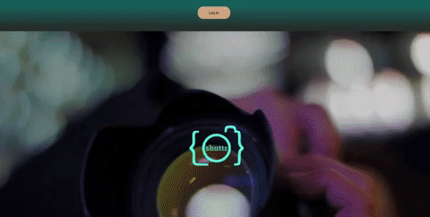
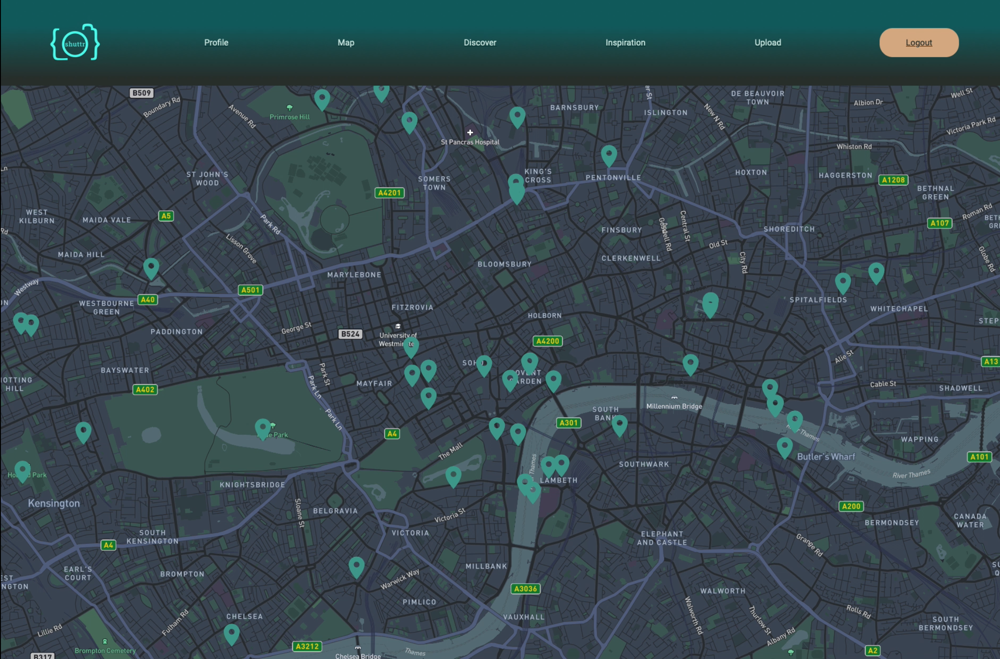
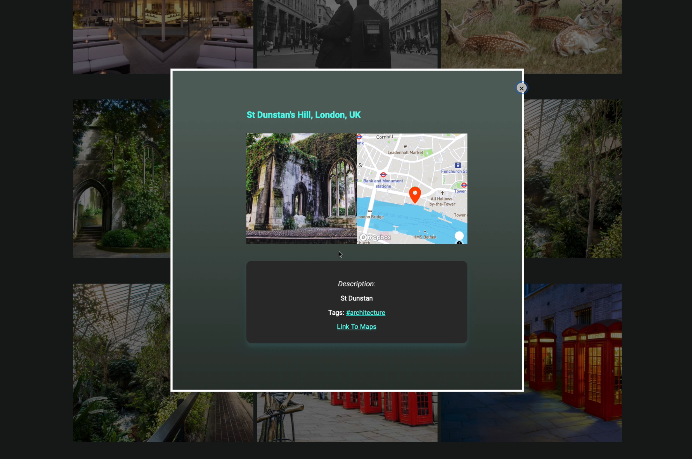

# shuttr 📸

Have you ever wanted to take amazing photos but don’t know where to go to take them?
We have the solution for you.
We wanted to build an innovative app for the creatives who love to take aesthetic photos but did not know where the prime locations were.
Shutter allows users to build a community where they can discover pins around London, explore hashtags you are interested in, run location searches, share your own photos and view other pins on a map.



<!-- Table of Contents -->

## Table of Contents

- [Overview](#overview)
- [Getting Started](#getting-started)
- [Features](#features)
  - [To Add](#to-add)
- [Planning](#planning)
  - [User Stories](#user-stories)
  - [Stretch Goals](#stretch-goals)
  - [Tech stack](#tech-stack)
- [Challenges](#challenges)

<!-- Overview -->

Map:


Feed:


Modal:


<!-- Getting Started -->

## Getting Started

Clone this repo and move into the project directory.
Run `yarn install` to ensure all node modules are running.

```
$ git clone https://github.com/philsmithies/shuttr.git
$ cd shuttr
$ yarn
```

Initialize the server and then run it

```
$ cd server
$ yarn
$ yarn server
```

Once yarn is installed you can run the project on the client side using this code

```
$ cd ..
$ yarn start
```

Visit `http://localhost:3000/` to view the app

<p>&nbsp;</p>

<!-- Features -->

## Features

- Create an account
- Password strength bar.
- View full screen map of all the posts within the locations (just London for now....)
- Upload photos with GPS coordinates created by user.
- View a dynamic map of hashtags.
- Direct link to the location of the photo via a modal of the image.
- View own posts on yours and other users profile.
- Remain logged in (remember token)
- Log out

<!-- To Add -->

### To Add

- Comments and ability to post multiple images to the same location.
- Mobile friendly / PWA support.

<!-- Planning -->

## Planning and Approach

<!-- User Stories -->

### User Stories

```
As a user
so that I can find interesting locations
I would like to sign up to the website
```

```
As a user
Because I would like to be able to access my account
I would like to login.
```

```
As a user
So I can be part of the community
I would like to be able to upload photos
```

```
As a user
So I can see where the hotspots are
I would like to be able to see the locations of the photos
```

=======
Have you ever wanted to take amazing photos but don’t know where to go to take them?
We have the solution for you.
We wanted to build an innovative app for the creatives who love to take aesthetic photos but did not know where the prime locations were.
Shutter allows users to build a community where they can discover pins around London, explore hashtags you are interested in, run location searches, share your own photos and view other pins on a map.

<p>&nbsp;</p>

## Planning and Approach

### User Stories

```
As a user
so that I can find interesting locations
I would like to sign up to the website
```

```
As a user
Because I would like to be able to access my account
I would like to login.
```

```
As a user
So I can be part of the community
I would like to be able to upload photos
```

```
As a user
So I can see where the hotspots are
I would like to be able to see the locations of the photos
```

```
As an avid creative
So I can be exposed to new genres
I would like to view the photos sorted by hashtags
```

```
As a user
So I can see everything I posted
I would like to see everything I've posted
```

```
As a wanderer
So I can see where I'm heading
I would like to see the locations pinned on a map
```

<!-- Stretch Goals -->

### Stretch Goals

```
As a user
So I can be on the leaderboard
I would like my photos to earn points
```

```
As a social media king
So I can get my photos on the homepage
When a user spends time on my photo I would like it to rank high
```

```
As a user
So that I can gain more content
When I level up I would like to unlock new features on the map
```

<!-- Tech Stack -->

## Tech Stack

- [React](https://reactjs.org)
  - Used as the Javascript framework of choice for the project. Handles the views logic of the project.
- [MongoDB](https://www.mongodb.com)
  - The database technology used.
- [NodeJS](https://nodejs.org/en/)
  - The technology used to handle the backend including authentication and other database requests.
- [Express](https://expressjs.com)
  - The featured NodeJS Web Framework.
- [HTML5](https://developer.mozilla.org/en-US/docs/Web/Guide/HTML/HTML5)
  - Used within the JSX components in React.
- [CSS3](https://developer.mozilla.org/en-US/docs/Archive/CSS3)
  - Used for the overall look of the site and its elements.

* APIs :
  - Google Maps API
  * [Mapbox](https://www.mapbox.com)
    - Used to handle the api requests for the main map page on the site.
  * [Cloudinary](https://cloudinary.com)
    - Image hosting that we integrated with MongoDB.
  * [Unsplash](https://unsplash.com)
    - Dynamic randomized images used for the sign up and login pages.

- [Material-UI](https://material-ui.com)
  - Used as the Javascript framework of choice for the project. Handles the views logic of the project.
- [Passport.JS](http://www.passportjs.org)
  - Used for Authentication.
- [Yarn](https://yarnpkg.com)
  - Package management.

<!-- Challenges -->

## Challenges

- One of the hardest parts was getting the api to generate for the user entry upon creation of posts. We found that the google maps api wasn't the best for visual changes so then integrated the MapBox api with it for getting a clean UI.
- Combining MongoDB with the Cloudinary image upload was tricky to handle the post requests.
- Using Passport to handle the auth and React's useContext hook was a new technology we hadn't handled before.

<div align="center">

---

[Top](#table-of-contents)

---

</div>

=======

```
As a user
So that I can gain more content
When I level up I would like to unlock new features on the map
```

### Planning

<a href="https://trello.com/b/fIF6u9fg/shuttr">Our Trello Board </a>

## How to use

Clone the client repo [here](https://github.com/tiffanyvallo/shuttr) and move into that project directory.
Run `yarn install` to ensure all node modules are running.
To use this app you will also need to clone this server repo.

```
$ git clone https://github.com/tiffanyvallo/shuttr.git
$ cd bankTechTest
$ yarn install
```

Once yarn is installed you can run the project on the client side using this code

```
$ yarn start
```

Make sure the server is also running with the following code

```
$ yarn dev
```

Visit `http://localhost:3000/` to view the app

## Tech Stack

- MongoDB
- Express
- React
- Node.js
- HTML
- CSS
- APIs :
  - Google Maps API
  - Mapbook
  - React-Map-GL
  - Cloudinary
  - Unsplash
- Material-Ui
- Passport.js
- BCrypt
- NPM
